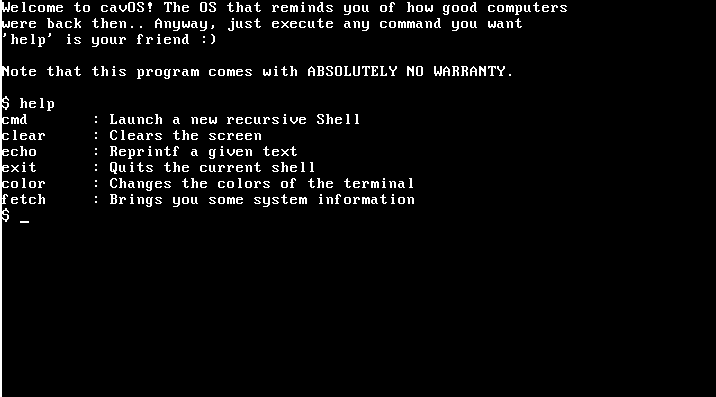

# Cave-Like Operating System

## Table Of Contents

- [Cave-Like Operating System](#cave-like-operating-system)
  - [Table Of Contents](#table-of-contents)
  - [Purpose](#purpose)
  - [Status](#status)
  - [Goals](#goals)
  - [Compiling](#compiling)
  - [License](#license)

## Purpose

**This is an OS I am making in my free time purely for fun.** I am learning a bunch of things about OS development while writing it. I had no plans to make it a public project, but after a few suggestions I decided to do it. 

## Status

**For now it has a basic, monolithic kernel and a few drivers built into it**. In addition the whole shell is crammed up inside the kernel creating a very compact operating system. 

The utilities are really simple, as **I have almost zero plans to make it bloated with useless apps/games**. If I ever do it in the future I'll create patches or generally have an option to exclude it from even compiling. It's important to mention that most of the software included doesn't use the full potential of the kernel. **You're supposed to write the stuff you want for yourself.** 

***To conclude everything, it needs a lot of polishing, time, and lines of code to be an OS that you could dual boot with your current installation.*** 

## Goals

Important to mention these goals may never be satisfied, take a very long time to be completed (we're talking years down the road) or may never be done at all. Furthermore, this list won't include every feature implemented or planned and can be changed at any time...

- Architecture: x86 (Intel i386)
  - [x] Interrupts: ISR, IRQ, GDT
  - [x] Scheduling
  - [x] Multitasking
- Device drivers
  - [x] ATA pio
  - [x] PCI read
  - [x] Serial driver
  - [x] Keyboard
  - [ ] Mouse
- Filesystems
  - [x] Fat32: Read operations
  - [ ] Fat32: Write operations
  - [x] Fat32: Full LFN support
- Networking stack
  - [ ] Ne2000 driver
  - [ ] ARP requests
  - [ ] TCP requests
  - [ ] UDP requests
  - [ ] DHCP
- Userspace 
  - [ ] Some sort of LibC
  - [ ] cavOS Specific Toolchain
  - [ ] Move to ring3
  - [x] ELF32 parsing
- Interfaces
  - [x] BIOS text
  - [x] Kernel shell
  - [ ] Userland shell
  - [ ] Distinct characteristic shell
  - [ ] Vim port
  - [ ] IRC client
- Graphics
  - [x] VGA driver (leveraging VESA)
  - [ ] Full graphical userland switch

## Compiling

Everything about this can be found over on `docs/install.md`. Go there for more info about building the OS correctly, cleaning unused binaries and other stuff. 

## License

This project is licensed under GPL v3 (GNU General Public License v3.0). For more information go to the LICENSE file.
