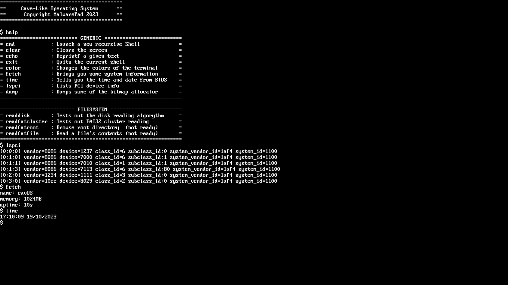

# Cave-Like Operating System

## Table Of Contents:
- [Cave-Like Operating System](#cave-like-operating-system)
	- [Table Of Contents:](#table-of-contents)
	- [Purpose:](#purpose)
	- [Status:](#status)
	- [Future plans:](#future-plans)
	- [Goals:](#goals)
	- [How to use it:](#how-to-use-it)
	- [License:](#license)

## Purpose:
**This is an OS I am making in my free time purely for fun.** I am learning a bunch of things about OS development while writing it. I had no plans to make it a public project, but after a few suggestions I decided to do it. 

## Status:
**For now it has a basic, monolithic kernel and a few drivers built into the kernel**. In addition the whole shell is built into the kernel creating a very compact operating system. 

The utilities are really simple, as **I have almost zero plans to make it bloated with useless apps/games**. If I ever do it in the future I'll create patches or generally have an option to exclude it from even compiling. It's important to mention that most of the software included doesn't use the full potential of the kernel. **You're supposed to write the stuff you want for yourself.** 

***To conclude everything, it needs a lot of polishing, time, and lines of code to be an OS that you could dual boot with your current installation.*** 

## Future plans:
I'm thinking of extending this project to a full operating system once I acquire all of the knowledge required. However this will purely come from experience as my primary goal from this os is to learn os development. 

## Goals:
Important to mention these goals may never be satisfied, take a very long time to be completed (we're talking years down the road) or may never be done at all.

[_] = not working on it yet

[ ] = not finished

[-] = partial

[x] = done

|Goal|Status|
|----|:-----:|
|Text Driver|[x]|
|Keyboard Driver|[x]|
|Shell Bases|[x]|
|Simple Shell|[-]|
|Filesystem (Hard)|[_]|
|Display Driver (Really Hard)|[_]|
|Full GUI (Impossible)|[_]|
|Network Driver|[_]|

## How to use it:
Everything about this can be found over on ``docs/install.md``. Go there for more info about using the docker environment building the OS correctly, cleaning unused binaries and other stuff. 

## License:
Since this is still in pre-beta state I really don't know where this kernel is going. We'll see about publishing for the public to see. But my main interest of this project is to have fun and learn things. 

**Please do not steal my code in the process as I would really appreciate some understanding in doing something as complex as creating a whole os from scratch alone.**
